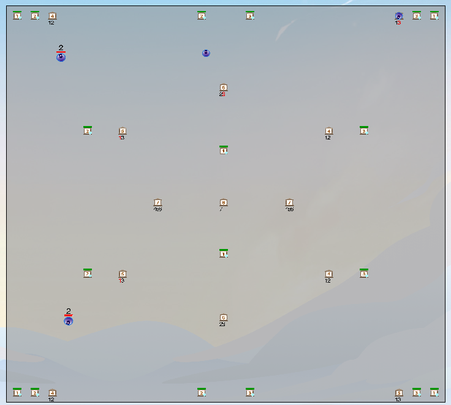

# Introduce

文件夹`WindowsRelease`用来存放判题器、回放工具及运行Demo.
文件夹`cppCode`用来存放具体的cpp代码.

# Usage

编译`cppCode`中的文件得到`main.exe`，在`WindowsRelease`目录下运行

```shell
# 运行时使用带有GUI的判题器
.\Robot_gui.exe -m .\maps\1.txt "..\cppCode\main.exe" 
# 或者
.\Robot.exe -m .\maps\1.txt "..\cppCode\main.exe" -f # '-f'表示快速模式
```


